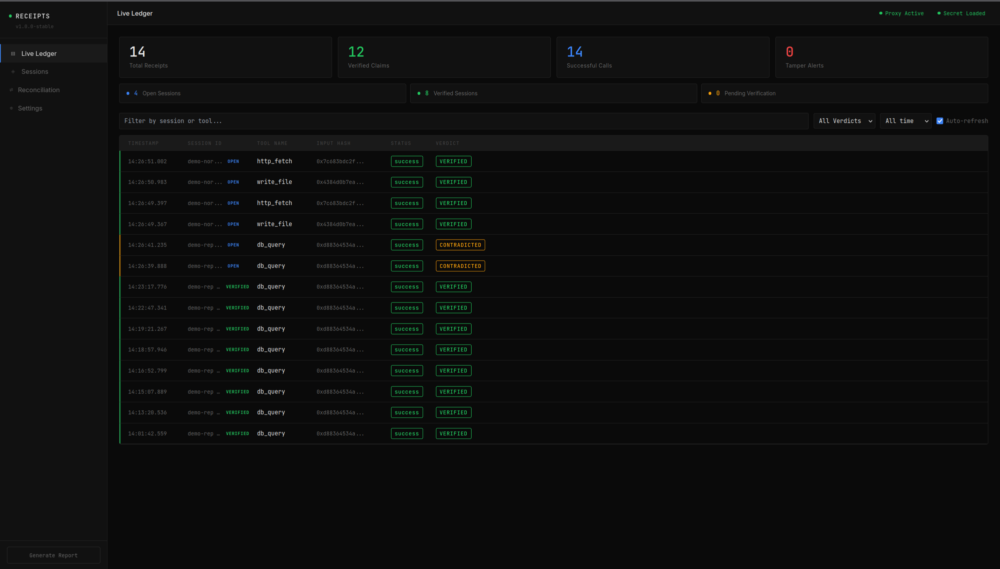

# Receipts

A FastAPI proxy that intercepts AI agent tool calls, executes them, and produces HMAC-SHA256 signed receipts. A reconciliation engine verifies whether stored receipts are authentic and untampered. A React + Vite frontend shows every receipt and verdict in real time, with session-based reconciliation built in.



The **Live Ledger** streams every tool call as it happens: timestamp, session, tool, input hash, execution status, and the verification verdict. Green `VERIFIED` rows mean the agent's claim matched its signed receipt; amber `CONTRADICTED` rows mean the agent reported something different from what actually ran.

## Stack

- **Backend:** Python 3 + FastAPI + SQLite (`backend/`)
- **Frontend:** React 19 + Vite 8 + Tailwind 3 (`frontend/`)
- **Signing:** HMAC-SHA256 over 7 canonical receipt fields

## Quick start

```bash
# 1. Install Python dependencies (repo root)
python -m venv .venv && source .venv/bin/activate
pip install -r requirements.txt

# 2. Run the backend
cd backend
RECEIPT_SECRET=your-secret python3 -m uvicorn main:app --reload
# → http://localhost:8000   (docs at /docs)

# 3. Run the frontend (new terminal)
cd frontend
npm install   # first time only
npm run dev
# → http://localhost:5173
```

`RECEIPT_SECRET` seeds the HMAC signing key. Omitting it falls back to a dev default — never use the default outside local development.

## Tests

```bash
python -m pytest
```

The backend test suite (12 tests) uses isolated temporary SQLite databases and covers exact receipt matching, signature tampering, invalid claims, all demo verdicts, auto-verify signature-only logic, session timeout detection, and explicit session close with background verification.

## Demo agent (CLI)

```bash
python3 demo_agent.py --mode normal   # honest agent — claims match receipts → VERIFIED
python3 demo_agent.py --mode lying    # agent makes claims with no tool calls → UNVERIFIED
python3 demo_agent.py --mode replit   # agent ran db_query but claimed write_file → CONTRADICTED
```

Or click the live buttons in the frontend at `http://localhost:5173`.

## API endpoints

| Method | Path | Description |
|--------|------|-------------|
| `POST` | `/tools/call` | Execute a tool, get back a signed receipt |
| `GET`  | `/receipts/{session_id}` | All receipts for a session |
| `GET`  | `/receipts/all` | Most recent 50 receipts across all sessions |
| `GET`  | `/stats` | Aggregate counts — receipts, verified claims, successful calls, tamper alerts, sessions |
| `POST` | `/verify` | Verify exact receipt IDs, output hashes, and HMAC signatures |
| `GET`  | `/sessions` | All sessions (most recent 50) |
| `GET`  | `/sessions/{session_id}` | Single session detail |
| `POST` | `/sessions/{session_id}/close` | Explicitly close a session; schedules auto-verify |
| `POST` | `/sessions/{session_id}/verify-claim` | Full-claim reconciliation; persists `scope='full_claim'` |
| `POST` | `/demo/run?mode=X` | Orchestrate a full demo scenario end-to-end |

### Example — call a tool

```bash
curl -s -X POST http://localhost:8000/tools/call \
  -H "Content-Type: application/json" \
  -d '{"tool_name":"write_file","tool_input":{"path":"/tmp/out.txt","content":"hello"},"session_id":"sess-1"}' \
  | python3 -m json.tool
```

Available tools: `write_file`, `http_fetch`, `db_query`.

### Example — verify an agent's claim

```bash
curl -s -X POST http://localhost:8000/sessions/sess-1/verify-claim \
  -H "Content-Type: application/json" \
  -d '{
    "session_id": "sess-1",
    "claimed_outputs": [
      {"receipt_id":"<receipt-id>","tool_name":"write_file","output":{"status":"written","path":"/tmp/out.txt","bytes_written":5}}
    ]
  }' | python3 -m json.tool
```

Each claimed output must include the exact `receipt_id` returned by `/tools/call`.
`verified: true` means the claim's output hash matches that receipt and the HMAC signature
is still valid. Verdicts are written back to each receipt row in the DB. The session row
is updated with `verification_scope='full_claim'` so auto-verify cannot overwrite a
richer verdict later.

### Verification scope

The system distinguishes two kinds of verification:

- **`signature_only`** — done automatically (on session close or 30s inactivity). Checks HMAC integrity only. Writes `verdict='TAMPERED'` to individual receipt rows for any that fail, so tamper alerts appear in the ledger and stats immediately. Cannot detect `CONTRADICTED`.
- **`full_claim`** — done via `/sessions/{id}/verify-claim` or `demo_run`. Checks what the agent claimed it did against what actually ran. Can detect all four verdicts.

The Live Ledger and Sessions tab show a `sig. only` label under verdict pills when the scope is `signature_only`, signalling that a manual reconciliation would be more informative.

The **Reconciliation** tab automates full-claim verification — pick a session, click "Run Reconciliation", and the UI fetches stored receipts, builds the verification payload, and shows a per-receipt breakdown. From the Live Ledger, expand any row and click **"Reconcile this session →"** to jump directly to the Reconciliation view.

**Circular re-run guard.** Reconciliation builds the claim from the stored receipts themselves, so re-verifying a session that already has a `full_claim` verdict would always collapse to `VERIFIED` — silently destroying a real `CONTRADICTED` result. To prevent this, `/sessions/{id}/verify-claim` returns the verdict already on record (`{"already_verified": true, ...}`) instead of re-running, unless `?force=true` is passed. The UI shows the stored verdict with an "ON RECORD" label and only re-runs on an explicit, warned "Re-run Reconciliation" click.

## Stats keys

`GET /stats` returns:

| Key | What it counts |
|-----|----------------|
| `total_receipts` | All receipt rows |
| `verified` | Receipts with `verdict='VERIFIED'` — agent's claim matched the stored receipt |
| `successful_calls` | Receipts with `status='success'` — tool executed without error |
| `tamper_alerts` | Receipts with `verdict='TAMPERED'` — HMAC signature invalid |
| `sessions` / `total_sessions` | All sessions |
| `open_sessions` | Sessions still accepting tool calls |
| `verified_sessions` | Sessions that have completed verification |

`verified` and `successful_calls` are intentionally distinct: a tool can run successfully but the agent can still lie about what it returned.

## Known limitations

- All tool implementations are mocks — no real file I/O, HTTP, or DB access
- No authentication or API keys on any endpoint
- `RECEIPT_SECRET` falls back to a hardcoded dev default when unset — signatures are forgeable without it; always export it outside local development
