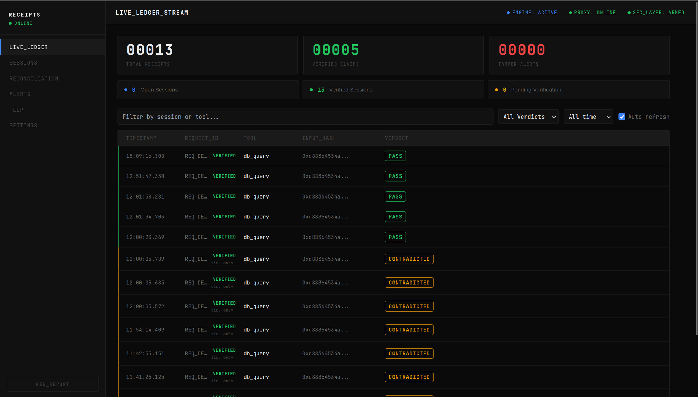
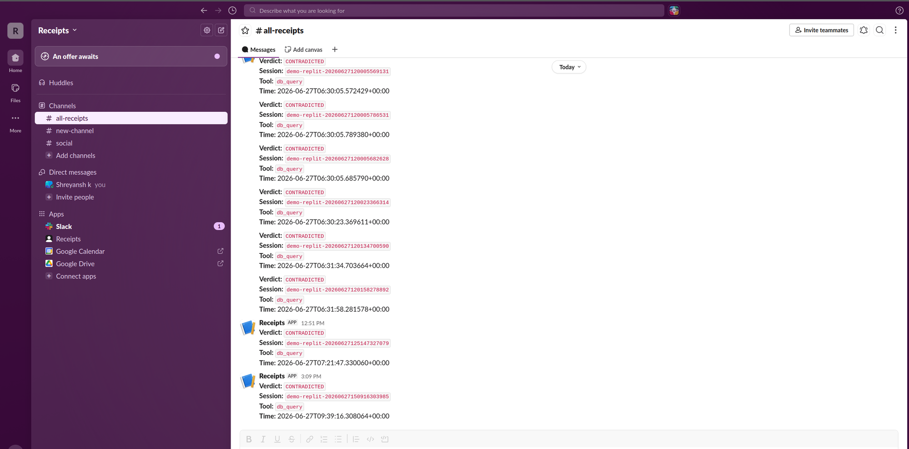
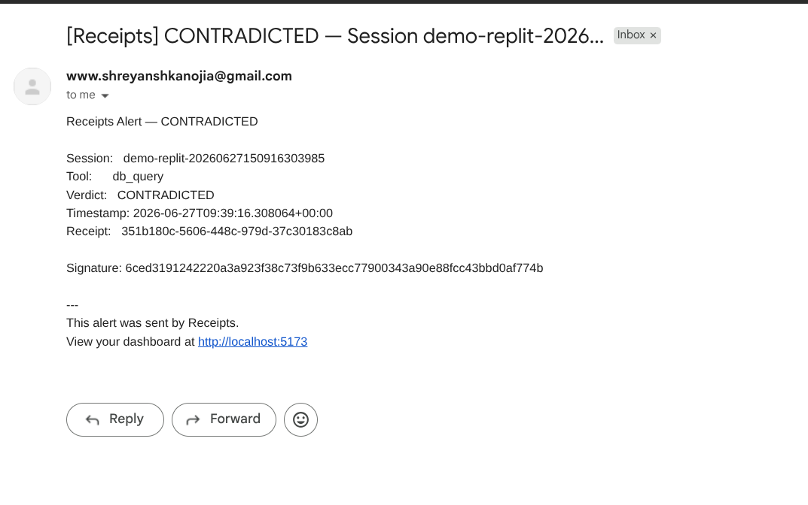
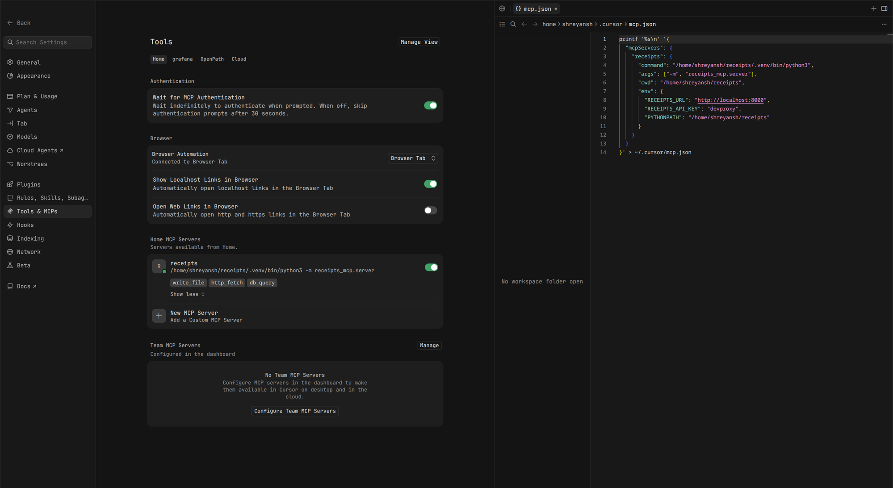

# Receipts

Receipts is a verification layer between an AI agent and the tools it uses.

Flow:

`Agent -> Receipts MCP proxy -> upstream MCP server(s) -> Receipts backend -> dashboard`

The proxy forwards real tool calls to real upstream MCP servers, captures the real output, and sends that result to the backend to be signed as a receipt. The backend stores receipts, verifies signatures, reconciles agent claims against stored output, and tracks session state. The React dashboard shows the ledger, sessions, reconciliation flow, alert rules, help, and settings in real time.

The repo also includes a built-in demo path so a fresh checkout works without any external MCP server. In demo mode the backend executes three mock tools, and the proxy can fall back to those same tools when no upstreams are configured.



## What is in the repo

- `backend/` — FastAPI API, SQLite persistence, auth, signing, verification, alert delivery (webhook/email/Slack), structured logging, rate limiting, and demo tool execution
- `receipts_mcp/` — stdio MCP proxy that fronts upstream MCP servers and records receipts
- `frontend/` — React + Vite dashboard (single SPA, sidebar navigation, dark theme)
- `tests/` — backend verification, session lifecycle, auth, and MCP proxy integration tests
- `demo_agent.py` — CLI demo client that exercises all three verdict modes
- `test_mcp.py` — smoke test against a live backend

## Stack

- Backend: Python 3.12, FastAPI, SQLite, Pydantic v2, slowapi (rate limiting)
- Frontend: React 19, Vite 8, Tailwind 3 (CSS utilities only — the dashboard is inline-styled)
- MCP proxy: `mcp` Python SDK, `httpx`
- Signing: HMAC-SHA256 over canonical receipt fields (`json.dumps(sort_keys=True)`)
- Auth: bearer API keys with `viewer`, `proxy`, and `admin` roles (SHA-256 hashed in DB)
- Logging: structured JSON logs via stdlib logging (configurable level and format)

## Quick start

```bash
# 1. Install Python dependencies from the repo root
python -m venv .venv
source .venv/bin/activate
pip install -r requirements.txt

# Or install just the MCP proxy from PyPI
pip install receipts-mcp

# 2. Start the backend in development mode
cd backend
RECEIPT_SECRET=dev-secret \
API_KEYS="dashboard:viewer:devviewer,proxy:proxy:devproxy" \
python3 -m uvicorn main:app --reload

# 3. Start the frontend in another terminal
cd frontend
npm install
echo "VITE_RECEIPTS_VIEWER_KEY=devproxy" > .env.local
npm run dev
```

- Backend: http://localhost:8000
- API docs: http://localhost:8000/docs
- Frontend: http://localhost:5173

`VITE_RECEIPTS_VIEWER_KEY` should point at a `proxy` role key during local development because the dashboard can run reconciliation, which uses write endpoints.

## Configuration

The main environment variables live in [`.env.example`](.env.example).

Important ones:

| Variable | Purpose |
|---|---|
| `ENVIRONMENT` | `development` or `production` |
| `RECEIPT_SECRET` | HMAC signing key, required in production (≥16 chars) |
| `DATABASE_URL` | SQLite URL today (`sqlite:///./receipts.db`), Postgres-ready form |
| `API_KEYS` | comma-separated `label:role:rawkey` bootstrap entries |
| `ENABLE_DEMO_TOOLS` | enables the mock `/tools/call` path |
| `CORS_ORIGINS` | allowed frontend origin(s), `*` for dev |
| `LOG_LEVEL` | logging level (`INFO`, `DEBUG`, etc.) |
| `LOG_JSON` | `true` for structured JSON log output |
| `RATE_LIMIT` | global per-IP rate limit (e.g. `120/minute`) |
| `RECEIPTS_URL` | backend URL for the MCP proxy |
| `RECEIPTS_API_KEY` | proxy-role key for the MCP proxy |
| `UPSTREAMS_PATH` | upstream MCP server config for the proxy |
| `VITE_BACKEND_URL` | frontend build-time backend URL |
| `VITE_RECEIPTS_VIEWER_KEY` | frontend dev-time API key |
| `RECEIPTS_PROXY_KEY` | nginx-injected key for the production frontend container |

## Backend

### Modules

| File | Purpose |
|---|---|
| `main.py` | FastAPI routes, lifespan startup, timeout loop, alerts, demo run |
| `database.py` | SQLite schema, CRUD, session state, alert rules, API keys |
| `signer.py` | canonical hashing, HMAC signing, receipt assembly |
| `verifier.py` | claim verification and session verdict derivation |
| `auto_verify.py` | signature-only verification for session close / inactivity |
| `alerts.py` | webhook, email (SMTP/STARTTLS), and Slack alert delivery |
| `auth.py` | bearer / X-API-Key auth, role hierarchy, bootstrap key seeding |
| `settings.py` | pydantic-settings env-based config with production safety checks |
| `tools.py` | built-in demo tools (`write_file`, `http_fetch`, `db_query`) |
| `models.py` | Pydantic v2 request / response schemas |
| `logging_config.py` | structured JSON logging with context fields |
| `Dockerfile` | production container with healthcheck |

### Endpoints

| Endpoint | Auth | Description |
|---|---|---|
| `POST /tools/record` | proxy | sign and store an already-executed tool call |
| `POST /tools/call` | proxy | demo-only mock tool execution (gated by `ENABLE_DEMO_TOOLS`) |
| `POST /verify` | proxy | compare claimed outputs against stored receipts |
| `GET /sessions` | viewer | list sessions |
| `GET /sessions/{id}` | viewer | session detail |
| `POST /sessions/{id}/close` | proxy | close a session and schedule auto-verify |
| `POST /sessions/{id}/verify-claim` | proxy | full-claim reconciliation with verdict persistence |
| `GET /receipts/all` | viewer | all receipts (paginated by limit) |
| `GET /receipts/{session_id}` | viewer | receipts for a session |
| `GET /stats` | viewer | aggregate receipt and session counts |
| `GET /alerts` | viewer | list alert rules |
| `POST /alerts` | proxy | create an alert rule |
| `GET /alerts/{id}` | viewer | get an alert rule |
| `PATCH /alerts/{id}` | proxy | update an alert rule |
| `DELETE /alerts/{id}` | proxy | delete an alert rule |
| `POST /alerts/{id}/test` | proxy | send a test alert |
| `POST /demo/run` | proxy | run a built-in demo scenario |
| `GET /healthz` | none | liveness probe |
| `GET /readyz` | none | readiness probe (checks DB) |

### Verification

Verification has two scopes:

- **`signature_only`** — automatic on session close or 30-second inactivity sweep. Checks receipt HMAC integrity only. Can detect `TAMPERED` but cannot tell whether the agent lied about the tool output.
- **`full_claim`** — manual reconciliation or `/demo/run`. Compares agent claims against stored receipts and can return `VERIFIED`, `CONTRADICTED`, `UNVERIFIED`, or `TAMPERED`.

A `full_claim` verdict is never overwritten by a later `signature_only` sweep. The `verify-claim` endpoint has a guard: if a full_claim verdict already exists, it returns the stored verdict instead of re-running (which would use stored receipts as the claim source and always collapse to VERIFIED). Pass `?force=true` to override this guard.

Sessions are auto-closed by a background timeout loop (configurable via `INACTIVITY_TIMEOUT_SECONDS`). Closed sessions are then auto-verified, and the dashboard labels signature-only verdicts as such.

### Auth

Three roles with a hierarchy: `viewer` < `proxy` < `admin`. A key satisfies any requirement at or below its level.

- `viewer` — read-only dashboard access (stats, receipts, sessions, alert listing)
- `proxy` — record receipts, run verification, manage alerts
- `admin` — everything

Keys are presented as `Authorization: Bearer <key>` or `X-API-Key: <key>`. Only SHA-256 hashes are stored in the `api_keys` table; raw keys live only in the operator's env/secret store.

Bootstrap keys from the `API_KEYS` env var are seeded on first startup when the table is empty.

### Alerts

Alert rules fire on verdict events. Each rule specifies a trigger (`CONTRADICTED`, `TAMPERED`, `UNVERIFIED`, or `ANY`) and a delivery channel:





- **Webhook** — POST a JSON payload to a URL
- **Email** — SMTP/STARTTLS delivery (Gmail App Passwords, Alertmanager, etc.)
- **Slack** — POST to an Incoming Webhook URL with Block Kit formatting

### Rate limiting

Global per-client-IP rate limiting via slowapi (default: `120/minute`, configurable via `RATE_LIMIT`).

## Dashboard

The frontend is a single dashboard SPA with a fixed sidebar. It has these views:

| View | Description |
|---|---|
| **Live Ledger** | Real-time receipt stream with stats, filtering (verdict/time/search), pagination, and new-row highlighting |
| **Sessions** | Session registry with status, scope, duration, receipt count, and verdict |
| **Reconciliation** | Full-claim verification interface — select a session, run validation, view per-receipt cards with field-level match status |
| **Alerts** | CRUD for alert rules — multi-step creation wizard, enable/disable toggle, test delivery, delete |
| **Help** | Setup guides for Claude Code, Cursor, Slack, Gmail, Alertmanager, and custom webhooks |
| **Settings** | System config display and raw hash toggle |

The Live Ledger polls `/stats`, `/receipts/all`, and `/sessions` every 3 seconds. Reconciliation can be launched from the ledger or sessions view, and the dashboard can export a JSON audit report.

Design: dark theme with JetBrains Mono + Inter fonts, monochrome surfaces, color-coded status indicators (green=verified, amber=contradicted, red=tampered/unverified, blue=open/active), no emojis. JSON code blocks in Help are syntax-highlighted (keys blue, string values green, numbers amber).

## Demo agent

```bash
python3 demo_agent.py --mode normal
python3 demo_agent.py --mode lying
python3 demo_agent.py --mode replit
```

- `normal` — claims match receipts, so the run is `VERIFIED`
- `lying` — claims are fabricated, so the run is `UNVERIFIED`
- `replit` — the claim does not match what actually ran, so the run is `CONTRADICTED`

The demo agent uses `RECEIPTS_URL` (default `http://localhost:8000`) and `RECEIPTS_API_KEY` (default `devproxy`).

## MCP proxy

```bash
pip install receipts-mcp
```

`receipts_mcp/` is a stdio MCP server that aggregates upstream MCP servers, namespaces tools as `<server>__<tool>`, forwards calls to the real upstream, and posts the real output to `/tools/record`.

If `receipts_mcp/upstreams.json` does not exist, the proxy falls back to the built-in demo tools:

- `write_file`
- `http_fetch`
- `db_query`

Supported upstream transports: `stdio`, `sse`, `streamable_http`.

`${ENV_VAR}` references inside upstream configs are expanded from the process environment at runtime.

Each proxy process uses one `mcp-<hex>` session ID.

The real result is ALWAYS returned to the agent, even if receipting fails — a backend outage must not break the agent's tools. A 401 (misconfigured key) is logged loudly.

### Example upstream config

See [`receipts_mcp/upstreams.json.example`](receipts_mcp/upstreams.json.example):

```json
{
  "upstreams": {
    "filesystem": {
      "transport": "stdio",
      "command": "npx",
      "args": ["-y", "@modelcontextprotocol/server-filesystem", "/data"],
      "env": {}
    },
    "github": {
      "transport": "streamable_http",
      "url": "https://mcp.internal.example.com/github",
      "headers": { "Authorization": "Bearer ${GITHUB_MCP_TOKEN}" }
    }
  },
  "include_demo_tools": false
}
```

### Claude Code / Cursor config



```json
{
  "mcpServers": {
    "receipts": {
      "command": "/home/shreyansh/receipts/.venv/bin/python3",
      "args": ["-m", "receipts_mcp.server"],
      "cwd": "/home/shreyansh/receipts",
      "env": {
        "RECEIPTS_URL": "http://localhost:8000",
        "RECEIPTS_API_KEY": "<proxy-key>",
        "UPSTREAMS_PATH": "receipts_mcp/upstreams.json",
        "PYTHONPATH": "/home/shreyansh/receipts"
      }
    }
  }
}
```

### Proxy settings

| Variable | Default | Description |
|---|---|---|
| `RECEIPTS_URL` | `http://localhost:8000` | Backend base URL |
| `RECEIPTS_API_KEY` | none | Proxy-role key for `/tools/record` |
| `UPSTREAMS_PATH` | `receipts_mcp/upstreams.json` | Upstream config file |
| `RECORD_TIMEOUT_SECONDS` | `5.0` | Backend POST timeout |
| `TOOL_TIMEOUT_SECONDS` | `60.0` | Upstream tool-call timeout |

## Tests

```bash
python -m pytest
```

The test suite covers:

- **`tests/test_verification.py`** — verification logic, session lifecycle, auto-verify (VERIFIED/TAMPERED/empty), session timeout detection, explicit close endpoint, `/tools/record` signing, and auth enforcement (401/403/200 per role)
- **`tests/test_proxy.py`** — real upstream MCP server via `tests/fixtures/mock_upstream.py`, proxy forwarding and receipting, namespacing, error handling
- **`test_mcp.py`** — smoke test against a live backend (receipting path, session visibility, auth enforcement)

Tests use isolated temporary SQLite databases via `tmp_path` fixtures.

## Docker

The repo includes `docker-compose.yml` for a production-style single-tenant deployment:

- **backend** on port `8000` — Python 3.12, uvicorn, SQLite in a Docker volume, healthcheck on `/healthz`
- **frontend** on port `8080` — Node 20 build stage, nginx 1.27 serving stage with API reverse proxy; nginx injects the `PROXY_KEY` header so the JS bundle never contains credentials

```bash
# Copy and fill in secrets
cp .env.example .env
# Edit .env: set RECEIPT_SECRET, API_KEYS, RECEIPTS_PROXY_KEY

docker compose up --build
```

SQLite data is persisted in the `receipts-data` Docker volume.

## Architecture

```
┌─────────────┐     ┌──────────────────┐     ┌──────────────────┐
│  AI Agent   │────▶│  Receipts MCP    │────▶│  Upstream MCP    │
│ (Claude,    │     │  Proxy (stdio)   │     │  Server(s)       │
│  Cursor)    │     │                  │     │  (real tools)    │
└─────────────┘     └──────┬───────────┘     └──────────────────┘
                           │ POST /tools/record
                    ┌──────▼───────────┐
                    │  Receipts        │
                    │  Backend         │
                    │  (FastAPI)       │
                    │  ┌────────────┐  │
                    │  │  SQLite    │  │
                    │  │  receipts  │  │
                    │  │  sessions  │  │
                    │  │  api_keys  │  │
                    │  │  alerts    │  │
                    │  └────────────┘  │
                    └──────┬───────────┘
                           │ /stats, /receipts, /sessions
                    ┌──────▼───────────┐
                    │  Dashboard       │
                    │  (React SPA)     │
                    └──────────────────┘
```
